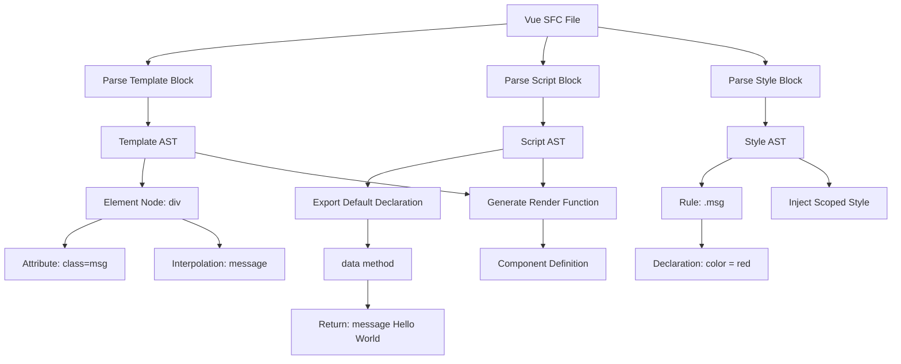

# Vue migration 

我正在设计一个 Vue 2 到 Vue 3 的规模化迁移方案，我需要你根据我的 task 编写迁移脚本。相关信息：

- vue-elment-admin 是原来的模板应用
- vue3-element-plus-admin 是新的工程模板（你要工作在这个工程中）
- migrate-cli 是未来我要编写的迁移脚本，将使用 gogocode 进行代码迁移，因此需要对齐原来的工程。

我的目标技术栈是： TypeScript/Javascript + vuex + vue router 4 + element-plus

Todos: 

1. 使用 Gogocode Vue 来转换 Vue 代码：https://github.com/thx/gogocode/tree/main/packages/gogocode-plugin-vue
2. SASS 迁移，结合 sass-migrator: https://sass-lang.com/documentation/breaking-changes/import/
3. Webpack 4 to 5: https://webpack.js.org/migrate/5/
4. 三方组件兼容层设计

